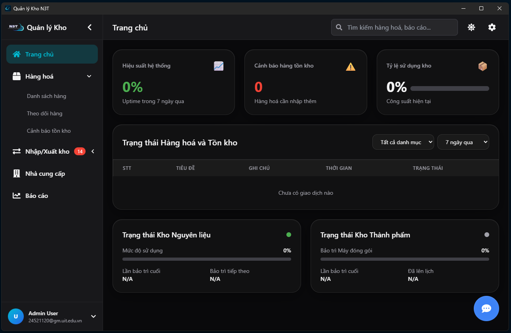

<div align="center">

  

  # 📦 Ứng dụng Quản lý Nhập Xuất Kho
  ### NT106_QuanLyKho_Nhom12

  [](LICENSE)
  
  
  

  <p>
    <b>Mục tiêu:</b> Quản lý hàng hóa, nghiệp vụ nhập/xuất kho, thống kê báo cáo và hỗ trợ người dùng qua Chatbot AI.
  </p>

  

</div>

---

## 🔸 Tóm tắt nhanh

Ứng dụng là giải pháp toàn diện gồm 2 thành phần chính, tích hợp sức mạnh của AI để hỗ trợ quản lý kho thông minh:

| Thành phần | Công nghệ chính |
| :--- | :--- |
| **🖥️ Desktop App** | React + TypeScript + Vite + Tailwind CSS + Tauri |
| **⚙️ Backend API** | FastAPI (Python) + SQLite + Gemini AI Client |

---

## 🟢 Nhóm phát triển

| STT | Họ và tên | MSSV | Vai trò (Dự kiến) |
|:---:|:---:|:---:|:---|
| 1 | **Hoàng Xuân Minh Trí** | 24521829 | Fullstack / Leader |
| 2 | **Trương Minh Thái** | 24521599 | Frontend Dev |
| 3 | **Nguyễn Võ Minh Trí** | 24521840 | Backend Dev |
| 4 | **Nguyễn Văn Nam** | 24521120 | Database / AI |

---

## ✨ Điểm nhấn & Tính năng chính

- ✅ **Quản lý sản phẩm:** Thêm, sửa, xóa, tìm kiếm nâng cao.
- 📦 **Nghiệp vụ kho:** Tạo phiếu nhập/xuất, tự động cập nhật tồn kho.
- 🏢 **Multi-warehouse:** Hỗ trợ cấu trúc nhiều kho/chi nhánh.
- 📊 **Dashboard thông minh:** Biểu đồ thống kê, cảnh báo hàng sắp hết (Low stock alert).
- 🛡️ **Phân quyền:** Cơ chế RBAC (Admin / Manager / Staff).
- 🤖 **Chatbot AI:** Trợ lý ảo sử dụng **Gemini API** để tra cứu nhanh và hướng dẫn sử dụng.

---

## 📂 Cấu trúc thư mục

```tree
NT106_QuanLyKho/
├── 📂 KhoHang_API/      # Backend (FastAPI, Database, AI Client)
│   ├── app/
│   ├── data.db          # SQLite Database
│   └── requirements.txt
├── 📂 UI_Desktop/       # Frontend (React + Tauri)
│   ├── assets/          # CHỨA ẢNH SCREENSHOT Ở ĐÂY
│   ├── src/
│   ├── src-tauri/       # Cấu hình Rust cho Tauri
│   └── package.json
├── 📜 .env.example      # Mẫu cấu hình môi trường
└── 📜 README.md
```
---

## 🚀 Hướng dẫn chạy nhanh (Quickstart)

# A. Backend (FastAPI)

```
# 1. Di chuyển vào thư mục API
cd KhoHang_API

# 2. Tạo môi trường ảo
python -m venv .venv

# 3. Kích hoạt môi trường (Windows)
.venv\Scripts\activate

# 4. Cài đặt thư viện
pip install -r requirements.txt

# 5. Setup biến môi trường (Tạo file .env từ .env.example)
# GEMINI_API_KEY=your_api_key
# DATABASE_URL=sqlite:///./data.db

# 6. Khởi chạy Server
uvicorn app.main:app --reload
```
🔗 API chạy tại: http://127.0.0.1:8000 | Docs: http://127.0.0.1:8000/docs

# B. Frontend (React + Tauri)

```
# 1. Di chuyển vào thư mục UI
cd UI_Desktop

# 2. Cài đặt packages
npm install

# 3. Khởi chạy ứng dụng
# Chạy chế độ Desktop App (Yêu cầu cài Rust & Cargo)
npm run tauri dev

# Hoặc chạy chế độ Web Browser
npm run dev
```
## 🤝 Contributing
Fork dự án.

Tạo branch feature: git checkout -b feat/ten-tinh-nang

Commit thay đổi: git commit -m "Thêm tính năng ABC"

Push lên branch: git push origin feat/ten-tinh-nang

Gửi Pull Request.

<div align="center"> <i>Dự án môn học NT106 - UIT</i>


<b>License MIT</b> </div>


-----
